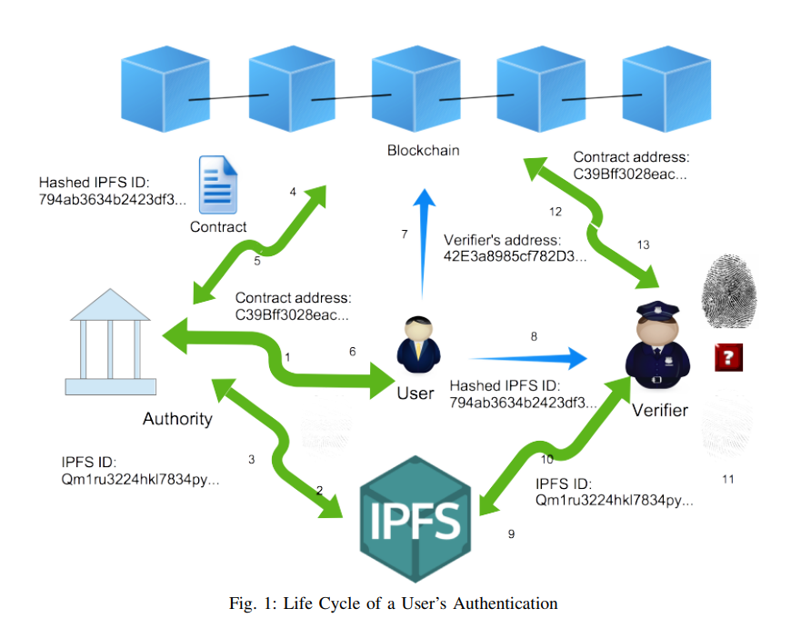

### Framework

1. user identity registration and smart contract construction (1-5)

2. access control management via smart contract (7)
3. identity information retrieval and verification. (8-13)

### Detail

user identity registration and smart contract construction (1-5)

1. user takes prove documents to DMV(authority) to register personal information

2. user store fingerprint(identity) in IPFS(a personal repository)

3. IPFS returns a hash ID as a retrieval key **to user** for the fingerprint image

   > why is to user instead of to Authority?

4. DMV hash and signs the combination of returned hash ID(from IPFS) and non-sensitive information. called signed attestation.

5. DMV integrate the signed  attestation into a smart contract.

   - the owner of smart contract is DMV; the owner of data is the registered user.
   - only owner can control the  access policies to the data; DMV can invoke or disable the smart contract.

6. DMV send contract address to user

access control management via smart contract (7)

7. user have the privilege to access and enter the smart contract, can set permission, whitelist and other things.

identity information retrieval and verification. (8-13)

8. user provide (1)hashed IPFS ID of fingerprint image (2) collect fingerprint again by verifier

9. verifier search the fingerprint image in IPFS by the hash ID

10. IPFS return the image

11. Verifier compare the image and collected fingerprint

    > proved this user is the owner of fingerprint image

12. Verifier access the smart contract to get the DMV's attestation about user.

13. Verifier use the public key of DMV and retrieve the hash value in step 4, then repeat the step 4 and get the hash value, compare with DMV's value.

    > proved the fingerprint image is collected in DMV

#### Conclusion

**Authority --(1)-- ID--(2)-- User**

if a verifier want to know whether the User is true, there are two things need to be proved: 

1. the **truly user**'s identity is **ID**
2. the **ID**'s owner is this **User**

- part 1 is verified by IPFS
- part 2 can be verified by smart contract

- Authority provide the evidence of part 1(attestation)