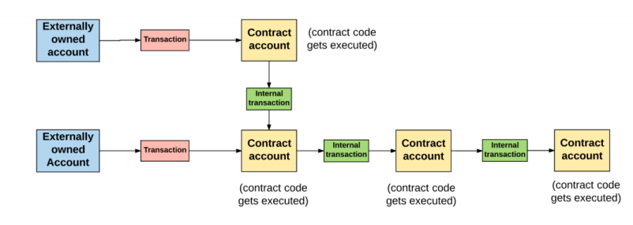
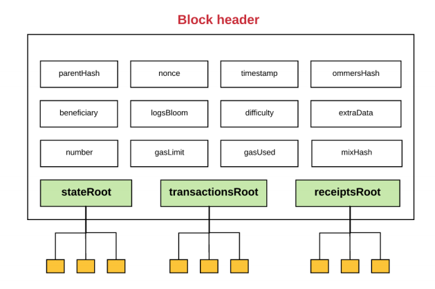

## Account

#### Externally owned account

- controlled by private keys
- no code

#### Contract account (auto)

- controlled by code
- can't initiate new transactions on their own
  - can fire transaction in response to other transaction they received

#### message from EA or CA to CA will activate the code of CA.

#### consist of:

- nonce: number of transactions send by account
- balance: number of wei
- storageRoot: root node of Merkle tree
- codeHash
  - empty for EA
  - hash of the code for CA

## Merkle Tree

- Binary tree, father is the Hash of two sons
- Large amount of leaves
- has a key shows the path to value
- full nodes and light nodes
- Merkle proof

## Gas and Payment

#### Gas

- Transaction cause by computation need fee
- the fee called gas
- measured in gwei
  - 1 Ether = 1^18^ wei
  - 1 gwei = 1^9^ wei

#### Gas in transaction

- sender set the gas limit and gas price
  - so the $max~transaction~fee = gas~limit * gas~price$
- A transaction will use the gas according to the process
- if the used gas small than max transaction fee, then return the remaining gas to sender
- else, the transaction failed, state revert and the gas won't return.
- all the gas will award to "beneficiary" address (typically the miner's address)

#### Fees for storage

- storage cost resource in Ethereum

#### Purpose of fees

- complex uses of smart contracts will put a strain on the network
- prevent users from overtaxing the network
- protect the network from deliberate attack such as a loop.
- encourage the calculate and storage in network

## Transaction and messages

#### Transaction

- is a cryptographically signed piece of **instruction**

- two types: message calls and contract creations

- consist:

  - nonce: number of transaction sent by the sender

  - gasPrice: price of unit gas

  - gasLimit: limit of gas

    > Why the fees be split into gasPrice and gasLimit?

  - to: address of the recipient

    > the contract account address does not yet exist, and so an empty value is used.

  - value: amount of wei to be transferred

  - v, r, s: variables to generate the signature

  - init(only exists for contract-creating transactions): Initialize the new contract account

  - data(optional and only exists for message calls): store data

#### Message and internal transactions:

- internal transactions will activate the code in CA
- from CA to CA

#### process:

- internal transactions or messages don't contain a **gasLimit**.

  >  If, in the chain of transactions and messages, a particular message execution runs out of gas, then that **message’s execution will revert**, along with any subsequent messages triggered by the execution. However, the parent execution **does not** need to revert.

  

## Blocks

#### consist of: 

- the **block header**
- a **set of transactions**
- a **set of other block headers for the current block’s ommers.**

#### Ommers:

- Orphaned Blocks: The competing blocks do not make it into the main chain

- Ommer Blocks: within the sixth generation or smaller of the present block.

- Ommers is for award the miners who mined the orphaned blocks

  > Because of the way Ethereum is built, **block times are much lower (~15 seconds) than those of other blockchains**, like Bitcoin (~10 minutes). This enables faster transaction processing. However, one of the downsides of shorter block times is that **more competing block solutions are found by miners.**

#### Block header:

- parentHash: a hash of the parent header

- ommersHash: hash of list of ommers

- beneficiary: the account will receives the award

- stateRoot: root of the trie of the state

- transactionsRoot: root of the trie of the transactions

- receiptsRoot: root of the trie of the receipts of the transactions

  > these three root are the root of Merkle tree

- logsBloom: a **Bloom filter**(data structure) consists of log information

- difficulty: difficulty level

- number: length to the genesis (depth)

- gasLimit: current gas limit

- gasUsed: total used gas in the block

- timestamp: time stamp of the block's inception (be created)

- extraData: data about the block

- mixHash and nonce: to proves the enough computation (prove of work)

#### Logs

- account address and event data
- stored in bloom filter

#### Transaction receipt

- Logs stored in the header come from the log information contained in the transaction receipt.

- include:
  - the block number
  - block hash 
  - transaction hash 
  - gas used by the current transaction
  - ...

#### Block difficulty

- increase the difficulty when a block validated quickly than the previous block.

- difficulty affect by **nonce**

- relationship between difficulty and nonce
  $$
  n \leq \frac{2^{256}}{H_d}
  $$
  where the H~d~  is the difficulty.

- adjust the time of validate a block by adjust the block difficulty

## Transaction Execution

#### Basic requirement of a transaction

- properly formatted **RLP**(Recursive Length Prefix)

- valid transaction signature

- valid transaction nonce (equal to sender's nonce)

- gas limit not less than the **intrinsic gas**:

  - a predefined cost (21,000 gas for executing the transaction)

    > why not in wei?

  - a gas fee for data sent(4 gas/byte for zero bytes, 68 gas/byte for non-zero bytes)

  - contract creation (32,000 gas)

    

- **Upfront cost**

  

